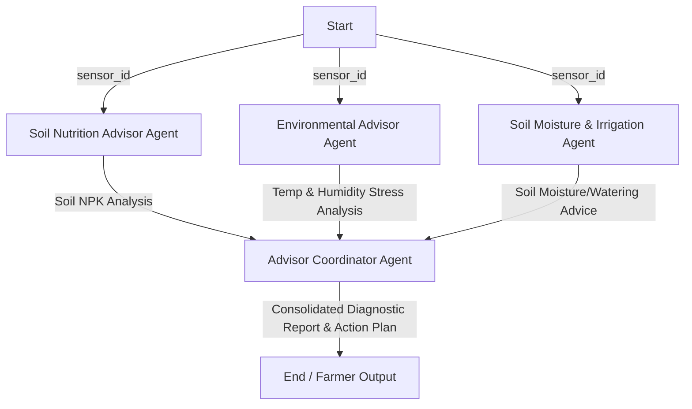

# PlantPulse Guardian AI 🌿🤖

PlantPulse Guardian AI is a beginner-friendly, modular, multi-agent agriculture advisor system built using the **Google Agent Development Kit (ADK)** and **Gemini**. The system helps farmers and agronomists evaluate soil health, diagnose atmospheric crop stress, assess irrigation requirements, and receive a single, cohesive action plan.

---

## 🏗️ Multi-Agent Architecture

The architecture utilizes a delegation pattern where specialized domain-expert agents process relevant sensor readings in parallel. A final coordinator agent aggregates their findings:



---

## 📁 Project Structure

Here is the directory layout of the generated skeleton:

```text
plantpulse_guardian_ai/
├── .env.example                # Template for environment variables
├── requirements.txt            # Python dependencies (google-adk, etc.)
├── README.md                   # Comprehensive documentation and file guides (this file)
└── src/                        # Main application package
    ├── __init__.py             # Root package initialization
    ├── main.py                 # Application entry point (runs the workflow)
    ├── agents/                 # Specialized ADK agents
    │   ├── __init__.py         # Sub-package initialization
    │   ├── soil_agent.py       # Soil Nutrition Agent skeleton (NPK analysis)
    │   ├── environment_agent.py# Environmental Agent skeleton (Temp/Humidity)
    │   └── moisture_agent.py   # Irrigation/Moisture Agent skeleton
    ├── tools/                  # Helper functions exposed as agent tools
    │   ├── __init__.py         # Sub-package initialization
    │   └── sensor_tool.py      # Field IoT sensor reader tool skeleton
    └── workflows/              # Agent orchestrations
        ├── __init__.py         # Sub-package initialization
        └── advisor_workflow.py # ADK Workflow definition linking agents together
```

---

## 📄 File Descriptions

### Configuration & Dependencies
*   **`.env.example`**: A template containing variables required for running the application. It defines `GEMINI_API_KEY` (needed for authentication with Gemini models) and `GEMINI_MODEL` (specifying the LLM version to use, defaults to `gemini-2.5-flash`).
*   **`requirements.txt`**: Lists python packages required by this project, including `google-adk` (Google Agent Development Kit) for orchestrating agents, `google-genai` for model API calls, and `python-dotenv` for loading environment configurations.

### Source Code (`src/`)
*   **`src/__init__.py`**: Initializer to mark the source directory as an importable Python package.
*   **`src/main.py`**: The entrypoint that loads environment variables, tests API key availability, and demonstrates how to run the multi-agent workflow asynchronously using `asyncio`.
*   **`src/tools/sensor_tool.py`**: Contains `get_soil_and_weather_metrics(sensor_id)`, a mock tool function. It mimics fetching soil NPK metrics, temperature, humidity, and moisture levels from IoT sensor nodes.
*   **`src/agents/soil_agent.py`**: Sets up the Soil Nutrition Advisor Agent. It is instructed to interpret Soil Nitrogen (N), Phosphorus (P), and Potassium (K) levels and suggest soil-fertility adjustments. It has access to the sensor tool.
*   **`src/agents/environment_agent.py`**: Sets up the Environmental Advisor Agent. It is instructed to evaluate temperature and humidity for crop stress conditions and pest/disease outbreak risks.
*   **`src/agents/moisture_agent.py`**: Sets up the Soil Moisture Agent. It is instructed to check volumetric water content and formulate precise watering and irrigation schedules.
*   **`src/workflows/advisor_workflow.py`**: Configures the execution path using the Google ADK `Workflow` graph. It dictates that when the workflow runs, the three specialized agents analyze the data simultaneously, and then pass their results to a final `advisor_coordinator` agent.

---

## ⚙️ Setup and Verification

### 1. Environment Setup
Clone/copy this directory, navigate into it, and create your local environment file:
```bash
cp .env.example .env
```
Open the `.env` file and replace `your_gemini_api_key_here` with your actual key from [Google AI Studio](https://aistudio.google.com/).

### 2. Dependency Installation
It is recommended to use a Python virtual environment:
```bash
python -m venv venv
# On Windows (cmd/PowerShell):
venv\Scripts\activate
# On Linux/macOS:
source venv/bin/activate

pip install -r requirements.txt
```

### 3. Syntax Verification
To verify the syntax of the created skeleton files, run the python compiler checks:
```bash
python -m py_compile src/**/*.py src/*.py
```

### 4. Running the Skeleton
To dry-run the entrypoint and verify packaging imports:
```bash
python -m src.main
```
