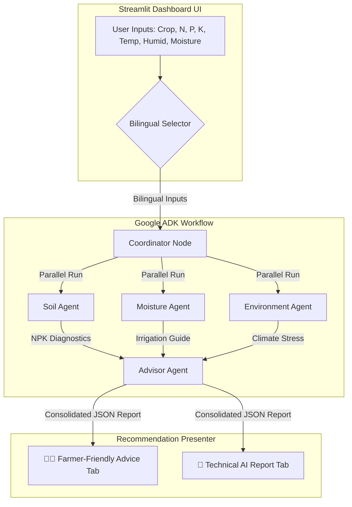

# 🌿 PlantPulse Guardian AI
### **AI-Powered Multi-Agent Agriculture Advisor**

[](https://www.kaggle.com)
[](https://streamlit.io)
[](https://github.com/google/adk-python)
[](https://deepmind.google/technologies/gemini/)

---

## 📋 Table of Contents
1. [Project Overview](#-project-overview)
2. [Problem Statement](#-problem-statement)
3. [The Solution](#-the-solution)
4. [Key Features](#-key-features)
5. [System Architecture](#-system-architecture)
6. [Project Workflow](#-project-workflow)
7. [Technologies Used](#-technologies-used)
8. [Demo Screenshots](#-demo-screenshots)
9. [Installation & Setup](#-installation--setup)
10. [Environment Configuration](#-environment-configuration)
11. [Offline Fallback Engine](#-offline-fallback-engine)
12. [Deployment](#-deployment)
13. [Future Enhancements](#-future-enhancements)
14. [Team & College Details](#-team--college-details)

---

## 🌿 Project Overview

**PlantPulse Guardian AI** is an advanced, localized multi-agent agricultural advisor designed to bridge the gap between technical agronomic data and practical farming decisions. Built using the **Google Agent Development Kit (ADK)** and **Gemini**, the application transforms raw soil sensor readings and environmental metrics into clean, actionable, and language-accessible directives for local farmers.

The platform is designed to be dual-purpose:
1. **Farmer-Friendly Dashboard**: Provides simple, conversational advice, crop-aware fertilizer guides with visual packaging cards, and local language localization.
2. **Technical AI Report**: Displays structured, node-by-node multi-agent outputs, crop health scores, and risk analysis summaries for agronomists, students, and judges.

---

## ⚠️ Problem Statement

Modern farming faces critical knowledge-gap challenges:
*   **Complex Soil Reports**: Raw laboratory or sensor readings (NPK ratios, EC, moisture percentages) are highly technical and difficult for smallholder farmers to interpret.
*   **Difficult Fertilizer Decisions**: Farmers often apply standard fertilizers blindly, leading to leaf burn, excessive chemical usage, soil degradation, and high expenditure.
*   **Unpredictable Weather & Stress**: Climate fluctuations induce sudden heat/cold stress and humidity-driven fungal disease risks.
*   **Expert Unavailability**: Professional agronomists and agricultural extension officers are rarely available for real-time crop consultations in rural communities.
*   **Language Barriers**: The vast majority of cutting-edge AI tools are built only in English, excluding non-English speaking farming populations.

---

## 💡 The Solution

**PlantPulse Guardian AI** tackles these issues by integrating the following components:
*   **Multi-Agent AI Reasoning**: Domain-expert agents work in parallel to evaluate soil nutrition, soil moisture, and atmospheric conditions, feeding into a consolidator advisor agent.
*   **Localized Farmer-Friendly Interface**: Explains issues using short sentences, simple words, and icons instead of paragraphs.
*   **Bilingual Translation Engine**: Full support for English and **Telugu (తెలుగు)** across the entire UI and recommendation logs.
*   **Deterministic Offline Fallback**: Keeps the dashboard functional in rural areas by switching to an embedded rule-engine if the internet drops or the API key fails.

---

## 🚀 Key Features

*   **Multi-Agent Coordination (Google ADK)**: Coordinates four cooperative agents to evaluate distinct agronomic layers.
*   **Crop-Aware Fertilizer Engine**: Dynamically recommends fertilizers matching specific crop types and deficiencies:
    *   *Rice* → Urea, DAP, MOP
    *   *Tomato* → Calcium Nitrate, Urea, MOP
    *   *Maize* → Urea, DAP
    *   *Chilli* → DAP, MOP (SOP)
    *   *Mango* → Organic Manure & NPK schedules
*   **Visual Fertilizer Cards**: Includes custom-generated realistic bag images (Urea, DAP, MOP, SSP, Calcium Nitrate) stored locally in the assets directory.
*   **Dual View Mode (Farmer vs. Technical)**: Separate tabs for simple actionable advice and detailed scientific multi-agent output.
*   **Circular Health Gauge**: Visual 360° crop health index with color-coded status rings (Green = Optimal, Yellow = Warning, Red = Alert).
*   **PDF & JSON Exports**: Generates downloadable PDF reports (in English for safe font rendering) and JSON summaries for historic records.
*   **Session-State History**: Stores past crop evaluations in memory so users can revisit past analyses.
*   **Bilingual Toggle**: Seamless runtime language switching between English and Telugu script.

---

## 🏗️ System Architecture

The application uses a parallel-execution multi-agent graph managed by the Google ADK workflow engine:



---

## 🔄 Project Workflow

1.  **Input Parameters**: The user selects a crop type and inputs sensor data (NPK values, temperature, humidity, and soil moisture) via Streamlit sliders.
2.  **Workflow Trigger**: Clicking **Analyze Crop** launches the ADK `InMemoryRunner`.
3.  **Parallel Execution**: 
    *   *Soil Agent* checks NPK levels.
    *   *Moisture Agent* evaluates watering indices.
    *   *Environment Agent* scans climate stress and disease risk.
4.  **Consolidation**: The *Advisor Agent* merges all individual evaluations, calculates the overall plant health score, and outputs a consolidated JSON structure.
5.  **Localization & Rendering**: The frontend parses the JSON, calls the Gemini translator to convert recommendation lists if Telugu is chosen, and populates the dashboard tabs and fertilizer cards.
6.  **Report Generation**: The user can export the final assessment as a PDF or JSON file.

---

## 🛠️ Technologies Used

| Technology | Purpose |
| :--- | :--- |
| **Python** | Core application development language |
| **Streamlit** | High-performance interactive UI/dashboard |
| **Google ADK** | Agent orchestration, session state, and execution graph |
| **Gemini API** | Reasoning, diagnostic consolidation, and translation (`gemini-2.5-flash`) |
| **HTML / CSS** | Glassmorphism card templates, responsive grids, and gauge animations |
| **dotenv** | Secure environment configuration management |
| **FPDF2** | English PDF summary generation |
| **Pydantic** | Structuring and validating agent outputs |
| **asyncio** | Concurrent multi-agent workflow execution |
| **Pillow** | Local image asset loading and rendering |

---

## 📸 Demo Screenshots

Below are screenshots demonstrating the bilingual, farmer-friendly, and technical features of the app:

### 1. Dashboard Overview & Input Panel
Shows the agricultural theme, crop selectors, NPK, and weather sliders:


### 2. Multi-Agent Analysis Progress
Visual loading indicators showing the real-time activation of the Soil, Moisture, Environment, and Advisor agents:


### 3. Plant Health circular Gauge & Risk Level Badge
Visual representation of the final compiled health score and agricultural risk:


### 4. Farmer-Friendly Advice Tab
Presents simple actionable advice divided into structured, left-bordered diagnostic cards:


### 5. Crop-Aware Fertilizer Recommendation Cards
Displays fertilizer cards containing custom-generated realistic bag images, application guidance, timing, and precautions:


### 6. Fully Localized Telugu Mode
Demonstrates complete UI translation and dynamic advice translation into Telugu script:


### 7. Technical AI Report Tab
For judges and researchers, showing the raw agent metrics, deficiencies list, and structured suggestions:


### 8. Downloadable Reports
Enables downloading PDF and JSON reports:


---

## ⚙️ Installation & Setup

Follow these steps to set up the dashboard locally:

### 1. Clone the Repository
```bash
git clone https://github.com/your-username/plantpulse_guardian_ai.git
cd plantpulse_guardian_ai
```

### 2. Set Up Virtual Environment
```bash
python -m venv venv

# On Windows (cmd/PowerShell):
venv\Scripts\activate

# On Linux/macOS:
source venv/bin/activate
```

### 3. Install Dependencies
```bash
pip install -r requirements.txt
```

### 4. Run the Streamlit Application
```bash
streamlit run app.py
```

---

## 🔑 Environment Configuration

Create a `.env` file in the root directory by copying `.env.example`:
```bash
cp .env.example .env
```
Open `.env` and fill in your Gemini API key:
```env
GEMINI_API_KEY=your_actual_gemini_api_key_here
GEMINI_MODEL=gemini-2.5-flash
```

---

## ⚡ Offline Fallback Engine

In rural areas, continuous internet connectivity is not guaranteed. **PlantPulse Guardian AI** implements an embedded, rule-based agronomic expert engine. 
*   **Trigger**: If the application fails to detect a `GEMINI_API_KEY` or encounters a network connection issue, it automatically activates the fallback.
*   **Result**: The app continues to evaluate soil health, classify soil moisture, assign risk levels, and recommend crop-aware fertilizers seamlessly, notifying the user: *“Note: Running in Offline Local Rule-Based mode since GEMINI_API_KEY is not configured.”*

---

---

## 🔮 Future Enhancements

*   **Real-Time Weather Integration**: Connect with OpenWeatherMap API to include dynamic 7-day local forecast updates.
*   **IoT Sensor Syncing**: Enable direct data ingestion from ESP32/Arduino-connected NPK, temperature, and moisture sensors.
*   **Leaf Disease Vision**: Integrate Gemini 2.5 Flash's multimodal features to diagnose plant diseases from leaf camera images.
*   **Voice Assistant**: Add voice output in Telugu for illiterate or visually-impaired farmers.
*   **Mobile App Companion**: Package the dashboard as a lightweight Android application.
*   **Government Scheme Mapper**: Match fertilizer deficiencies and crop types to current government subsidies and agricultural schemes.

---

## 👥 Team & College Details

*   **Team Name**: Plant Pulse Guardian
*   **Team Members**:
    *   **Dhana Vikhyat Pinnamareddy** (Team Lead) – CSE (Internet of Things)
    *   **CH H V V Satyanarayana** – CSE (Artificial Intelligence & Machine Learning)
*   **College**: Aditya College of Engineering and Technology
*   **Developed for**: Kaggle AI Agents Capstone Project
